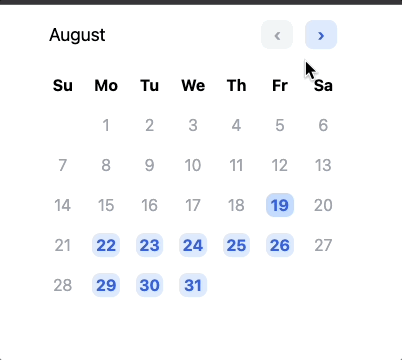

# Personal Astro Playground

I had an idea in this twitter thread here:

https://twitter.com/thomasreggi/thread/1560397466104745986

It's about creating a "widget" that can provide isolated functionality and save data. Like a "mini app" / "micro app"?.

The index has the main idea:

## Widget Screenshot:



## Single source:

```ts
---
import Layout from '../layouts/Layout.astro';
import { Calendar, calendarServer } from '../mods/Calendar'
let json
if (Astro.request.method === 'POST') {
  const body = await Astro.request.json();
  await calendarEndpoint(body)
  Astro.response.headers.set('Content-Type', 'application/json');
  const json = JSON.stringify({ok: true})
}
---
{ json ? (
  <Fragment set:html={json}></Fragment>
) : (
  <Layout title='hi'>
    <Calendar client:visible/>
  </Layout>
)}
```

WARNING: Right now it just stores the entire JSON payload, which is super insecure. 